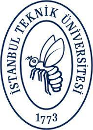
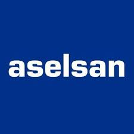

## Short Bio
I am currently a software design engineer for Digital Signal Processing ([DSP](https://en.wikipedia.org/wiki/Digital_signal_processing)) projects. I've hands-on experience with C, C++ and Python. I'm passionately interested in Graph Neural Networks ([GNNs](https://en.wikipedia.org/wiki/Graph_neural_network)) and their characteristics on GPGPUs.

---

## Publications

- ### Analyzing the Traffic of MANETs using Graph Neural Networks
  - **T. Tekdogan** • 2022 • International Conference on Machine Learning & Applied Network Technologies (ICMLANT) • December 2022 • _Accepted, to be published in IEEE Conference Proceedings_. [_arXiv preprint_]()

- ### gSuite: A Flexible and Framework Independent Benchmark Suite for Graph Neural Network Inference on GPUs
  - **T. Tekdogan**, S. Goktas, and A. Yilmazer-Metin • 2022 • IEEE International Symposium on Workload Characterization (IISWC) • November 2022 • _Accepted, to be published in IEEE Conference Proceedings_. [_arXiv preprint_](https://arxiv.org/abs/2210.11601)

- ### Benchmarking Apache Spark and Hadoop MapReduce on Big Data Classification
  - **T. Tekdogan** and A. Cakmak • 2021 • 5th International Conference on Cloud and Big Data Computing (ICCBDC) • August 2021 • Pages 15–20 • [ACM International Conference Proceedings Series (ICPS) 2021](https://dl.acm.org/doi/fullHtml/10.1145/3481646.3481649). [_arXiv preprint_](https://arxiv.org/abs/2209.10637).

---

## Education

- ### Master's Degree • Istanbul Technical University 
  - Computer Engineering • 2020 - Present

- ### Bachelor's Degree • Ankara University 
  - Computer Engineering • 2015 - 2019

---

## Experience

- ### Software Design Engineer • ASELSAN Inc.  
  - Feb 2019 - Present

- ### Intern • ASELSAN Inc.  
  - Jul - Aug 2018 (2 months)

- ### Intern • UDEA Electronics  
  - Aug - Sep 2017 (2 months)

---

## Awards

- ### Best Presentation Award
  - My presentation of the paper 'Benchmarking Apache Spark and Hadoop MapReduce on Big Data Classification' was awarded as the best presentation of the 2021 5th International Conference on Cloud and Big Data Computing, held at University of Liverpool, Liverpool, United Kingdom (virtual event) during August 13-15, 2021. [_Link to the conference page_](http://www.iccbdc.org/iccbdc21.html)

