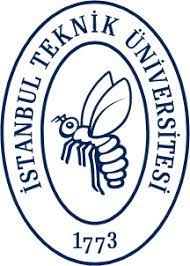
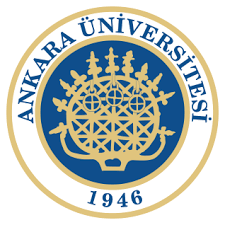
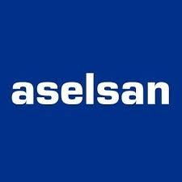

## Short Bio
I am a PhD student at TU Berlin, supervised by [Prof. Volker Markl](https://www.tu.berlin/en/dima/about-us/prof-dr-volker-markl).
I am also a member of the graduate school of the [BIFOLD](https://www.bifold.berlin/) (Berlin Institute for the Foundations of Learning and Data).

My current research interest is benchmarking distributed streaming processing systems.

---

## Publications 📜
_(in reverse chronological order)_

- ### NebulaStream: An Extensible, High-Performance Streaming Engine for Multi-Modal Edge Applications  
  - S. Zeuch, A. Michalke, A. Lepping, V. Markl, R. Martinez, N. Schubert, L. Schwerdtfeger, **T. Tekdogan**, A. Ziehn, C. Falkensteiner, K. Krueger, A. Meyer, T. Roeschl, and S. Wilkending • 2025 • ACM SIGMOD/PODS '25: Companion of the 2025 International Conference on Management of Data • _Published in the Proceedings of the SIGMOD/PODS'25_ • Pages 195 - 198 • June 2025 • [DL ACM Link](https://dl.acm.org/doi/10.1145/3722212.3725118)

- ### Using and Enhancing NebulaStream - A Tutorial 
  - S. Zeuch, A. Chaudhary, V. Rosenfeld, **T. Tekdogan**, A. Michalke, M. Goerdel, A. Ziehn, and V. Markl • 2024 • ACM International Conference on Distributed and Event-based Systems (DEBS '24) • _Published in the Proceedings of the 18th ACM International Conference on Distributed and Event-based Systems_ • Pages 212 - 216 • July 2024 • [DL ACM Link](https://dl.acm.org/doi/10.1145/3629104.3674126)

- ### GPGPU Application for Signal Processing – An Implementation for DDC Algorithm 
  - U. Bilgin, M. Sever, and **T. Tekdogan** • 2022 • Turkish National Software Engineering Symposium (UYMS) • December 2022 • [Published](https://ekitap.atauni.edu.tr/index.php/16-ulusal-yazilim-muhendisligi-sempozyumu-bildiri-kitabi/) in the conference proceedings.

- ### Analyzing the Traffic of MANETs using Graph Neural Networks 
  - **T. Tekdogan** • 2022 • International Conference on Machine Learning & Applied Network Technologies (ICMLANT) • December 2022 • _Published in the IEEE Conference Proceedings_ • [_IEEE Xplore link_](https://ieeexplore.ieee.org/document/9996518) • [_arXiv preprint_](https://arxiv.org/abs/2212.08923)

- ### gSuite: A Flexible and Framework Independent Benchmark Suite for Graph Neural Network Inference on GPUs 
  - **T. Tekdogan**, S. Goktas, and A. Yilmazer-Metin • 2022 • IEEE International Symposium on Workload Characterization (IISWC) • November 2022 • _Published in the IEEE Conference Proceedings_ • [_IEEE Xplore link_](https://ieeexplore.ieee.org/abstract/document/9975401) • [_arXiv preprint_](https://arxiv.org/abs/2210.11601)

- ### Benchmarking Apache Spark and Hadoop MapReduce on Big Data Classification  
  - **T. Tekdogan** and A. Cakmak • 2021 • 5th International Conference on Cloud and Big Data Computing (ICCBDC) • August 2021 • Published in the [ACM International Conference Proceedings Series (ICPS) 2021](https://dl.acm.org/doi/fullHtml/10.1145/3481646.3481649) • Pages 15–20 • [_arXiv preprint_](https://arxiv.org/abs/2209.10637)

---

## Education 🎓

- ### PhD • Technische Universität Berlin 
  - Computer Science • 2023 - Now

- ### Master's Degree • Istanbul Technical University 
  - Computer Engineering • 2020 - 2023

- ### Bachelor's Degree • Ankara University 
  - Computer Engineering • 2015 - 2019

---

## Experience 💼

- ### Research Associate • TU Berlin 
  - Dec 2023 - Now

- ### Software Design Engineer • ASELSAN Inc.  
  - Feb 2019 - Dec 2023 (4 years)

- ### Intern • ASELSAN Inc.  
  - Jul - Aug 2018 (2 months)

- ### Intern • UDEA Electronics  
  - Aug - Sep 2017 (2 months)

---

## Awards 🏆

- ### Best Demo Honorable Mention
  - Our demo 'NebulaStream: An extensible, high-performance streaming engine for multi-modal edge applications' received the best demo honorable mention in the SIGMOD 2025. [_Link to the conference page_](https://2025.sigmod.org/sigmod_awards.shtml)

- ### Best Presentation Award
  - My presentation of the paper 'Benchmarking Apache Spark and Hadoop MapReduce on Big Data Classification' was awarded as the best presentation of the 2021 5th International Conference on Cloud and Big Data Computing, held at University of Liverpool, Liverpool, United Kingdom (virtual event) during August 13-15, 2021. [_Link to the conference page_](http://www.iccbdc.org/iccbdc21.html)
